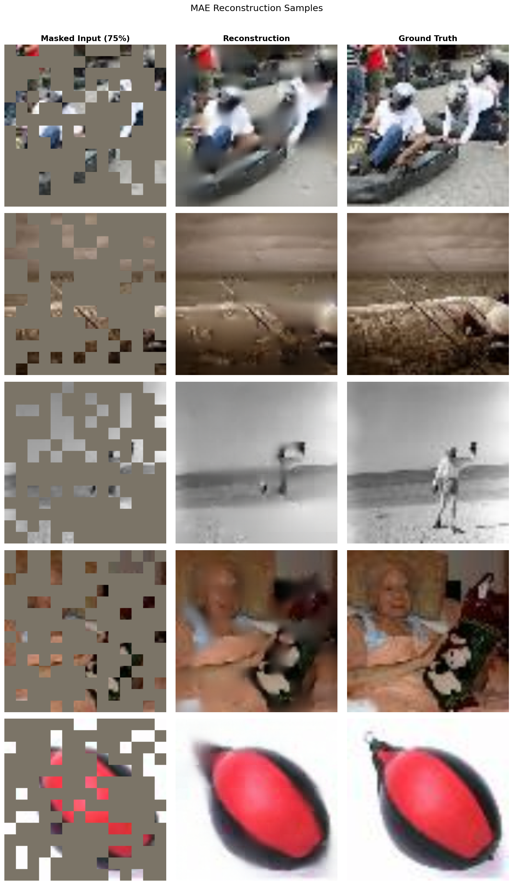
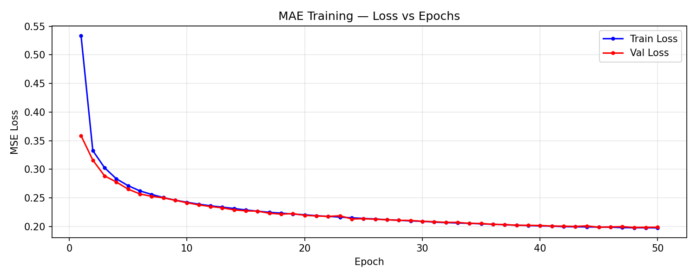

# Masked Autoencoders (MAE) Are Scalable Vision Learners

This repository contains a concise, from-scratch PyTorch implementation of **Masked Autoencoders (MAE)**, a self-supervised learning architecture introduced in the prominent paper *"Masked Autoencoders Are Scalable Vision Learners"* by Kaiming He et al.

The model is trained on the **Tiny ImageNet** dataset and learns to reconstruct highly masked images (up to 75% missing pixels). It does this by leveraging an asymmetric encoder-decoder design built upon Vision Transformers (ViT).

---

## 📊 Visual Results

### Image Reconstruction (75% Masking Ratio)
The model takes an image, drops 75% of its patches, encodes the remaining 25%, and then uses a lightweight decoder alongside mask tokens to predict the missing pixels.


*(Left: 75% Masked Input | Middle: Model Reconstruction | Right: Ground Truth)*

### Training Curve
The model is trained to minimize the Mean Squared Error (MSE) loss, computed **strictly on the masked patches**. 


---

## 🏗️ Architecture Details

*   **Encoder:** **ViT-Base** (12 layers, 768 embedding dimension, 12 attention heads). Crucially, the encoder only operates on the visible 25% of patches, drastically reducing computational overhead.
*   **Decoder:** **ViT-Small** (12 layers, 384 embedding dimension, 6 attention heads). The decoder reconstructs the full image from both the encoded representations and a set of learnable mask tokens.
*   **Patch Size:** 16x16 pixels
*   **Default Masking Ratio:** 75%

## 📈 Performance Evaluation

Evaluated against the validation set (after Early Stopping parameter optimizations), the visual fidelity metrics of the reconstructed images are:
*   **Average PSNR** (Peak Signal-to-Noise Ratio): `22.10 dB`
*   **Average SSIM** (Structural Similarity Index): `0.7081`

---

## 🚀 Interactive Web UI Demo (Gradio)

The notebook includes a fully interactive UI built using **Gradio**. You can deploy it locally or share highly accessible links to:
1. Upload external, real-world images.
2. Dynamically adjust the `Mask Ratio` using a visual slider (ranging from 50% to 95%).
3. Observe live how the model hallucinates and reconstructs the masked layout in real-time.

---

## 🛠️ Setup & Usage

**1. Install required dependencies:**
```bash
pip install torch torchvision timm einops matplotlib scikit-image gradio
```

**2. Explore the Pipeline:**
Open the provided `Masked_Auto_Encoders.ipynb` notebook. The code is structured in a clear, step-by-step educational flow that includes:
*   Data loaders preparation for `tiny-imagenet-200`.
*   Custom utilities for patchification, unpatchification, and random sampling masks.
*   From-scratch PyTorch `nn.Module` classes for the Multi-Head Self-Attention, Transformer Blocks, MAEEncoder, and MAEDecoder.
*   A robust training loop incorporating **Mixed Precision (`autocast`)**, **Cosign Annealing Scheduler**, and **Multi-GPU `DataParallel`** distribution.
*   Visualization utilities and quantitative metric measurement scripts.

## 🧠 Training Strategy
*   **Optimizer:** `AdamW` (Learning rate = 1.5e-4, Weight Decay = 0.05)
*   **Regularization/Normalization:** Extensive `LayerNorm` logic with scaled attention blocks. Gradient clipping ensures stable convergence.
*   **Early Stopping Validation:** Monitors validation loss, with a patience threshold of 7 epochs to stop training if generalization stalls, retaining the best `mae_best.pth` checkpoint.
